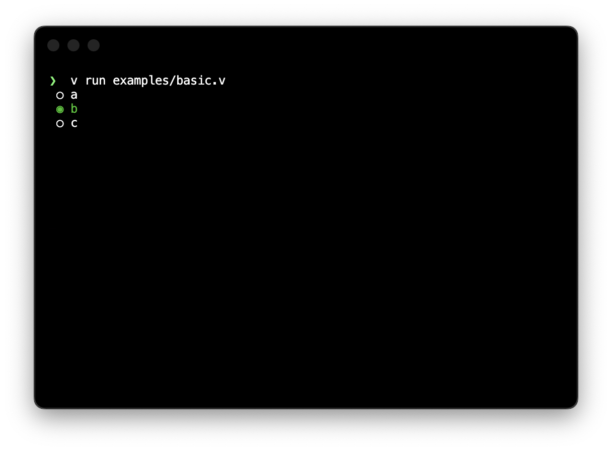
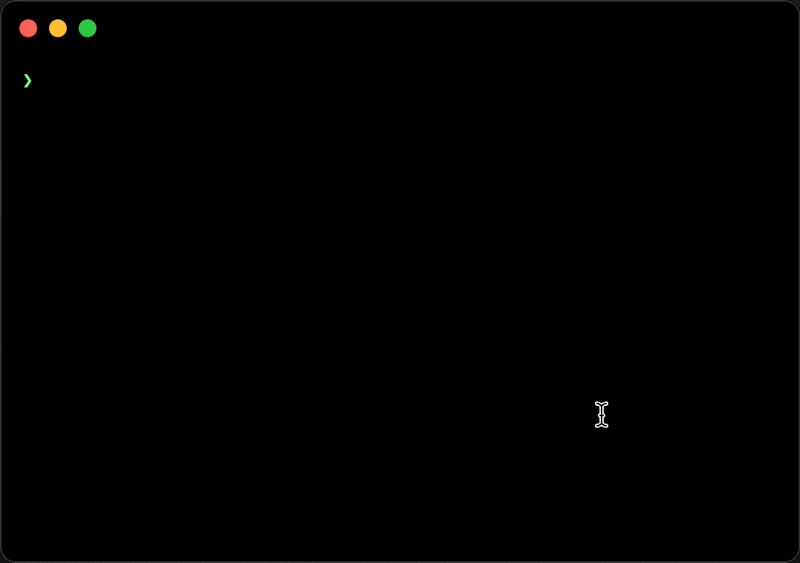

simple term lib.



## Install

## Usage

### Select

```v
import sterm { Selection }

fn main() {
	mut sel := Selection{
		items: ['a', 'b', 'c']
		idx: 0
		hide_cursor: true
	}
	sel.draw()
	sel.run()

	println('You selected "${sel.value()}"')
}
```


